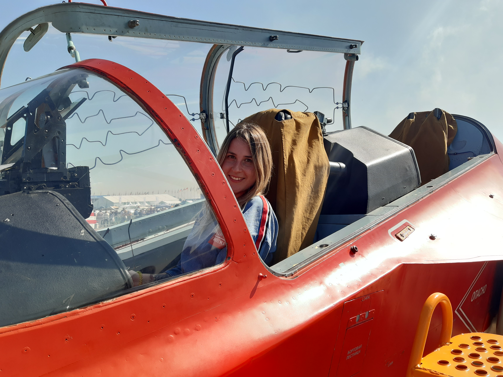

# Мартынкевич Анастасия Сергеевна

 **Дата рождения:** 19.10.1993 (28 лет)
 
 **Семейное положение:** замужем
 
 **Образование:** Высшее. 2011-2018, Московский авиационный институт, факультет: Робототехника и интеллектуальные системы, специальность: Интегрированные системы ЛА.  

**Опыт работы:** 
* 2018 год. Специалист по методической работе, АНО ДПО "Институт повышения квалификации ТЕХНОПРОГРЕСС"
* 2019 - н.в. Специалист по управлению проектами, Московский авиационный институт.

**Личные качества:**
- Целеустремленность
- Легкообучаемость
- Ответственность
- Коммуникабельность
- Умение работать в команде

**Навыки:**
* Уверенный пользователь ПК
* Начальный уровень знаний Java
* Организация мероприятий